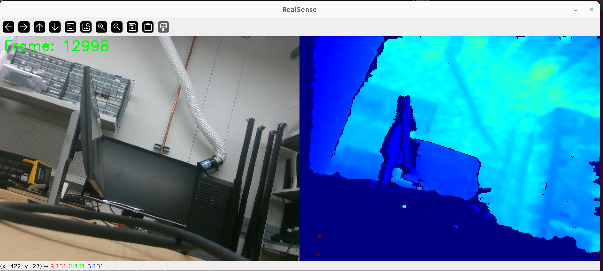

# RealSense D435 Synchronized Streaming

Minimum working script for synchronized streaming from two RealSense D435 cameras with web-based recording.

## Hardware Requirements

- Intel RealSense D435 cameras
- **High-quality USB-C to USB-C cables** (USB-A adapters may cause frame timeout errors)
- USB 3.0+ ports

## Setup

### 1. System Permissions (Critical)
Add your user to the required groups for RealSense access:
```bash
sudo usermod -a -G video,plugdev $USER
```
**Important**: You must logout and login again after running this command.

Verify groups after logout/login:
```bash
groups
```

### 2. Install Dependencies
```bash
pip install -r requirements.txt
```

**Note**: If you encounter `pyrealsense2` installation errors, check for name conflicts with local files named `pyrealsense2.py` in your working directory.

### 3. Hardware Connection
- Connect RealSense D435 cameras using **USB-C to USB-C cables only**
- Ensure USB 3.0+ connection
- For multiple cameras, use separate USB controllers if possible

### 4. Verify Setup
Test your setup step by step:

1. Check USB detection:
```bash
lsusb | grep Intel
```
Should show: `ID 8086:0b07 Intel Corp. RealSense D435`

2. Test single camera first:
```bash
python official_minimal_stream.py  
```

3. Verify streaming works with one camera (RGB and Depth) before attempting dual-camera setup



*Example: The official minimal RealSense streaming script displays a live color image window (from the D435 camera), with keyboard controls for saving frames or exiting. The window should show a real-time video feed similar to the above screenshot. If you see a black window or no image, check your camera connection and permissions.*


## Usage

### Quick Start

1. **Start the multi-camera server**:
   ```bash
   source .venv/bin/activate
   python multi_camera_server.py
   ```
   
   Expected output:
   ```
   Starting Multi-Camera WebSocket server on localhost:8765
   Searching for RealSense cameras...
   Found 2 RealSense camera(s):
     Camera 0: Intel RealSense D435 (Serial: 250122071300, FW: 5.13.0.55)
     Camera 1: Intel RealSense D435 (Serial: 250222071931, FW: 5.13.0.55)
   Successfully initialized 2 camera(s)
   WebSocket server running on ws://localhost:8765
   Open index.html in your browser to view the streams
   ```

2. **Open the web interface**:
   - Open `index.html` in your web browser
   - Or navigate to: `file:///path/to/your/project/index.html`

3. **View live streams**:
   - Left panel: Camera 1 (Color Stream)
   - Right panel: Camera 2 (Depth Stream placeholder - currently shows Camera 2)
   - Status indicators show connection and sync status

4. **Record videos**:
   - Click "Start Recording" to begin recording both cameras
   - Click "Stop Recording" to end recording
   - Videos are saved to the `recordings/` folder with filenames:
     - `camera_{serial1}_{timestamp}.mp4`
     - `camera_{serial2}_{timestamp}.mp4`

### Alternative: Single Camera Mode

For testing with one camera:
```bash
python official_minimal_stream.py
```
This opens an OpenCV window with color + depth streams side by side.

## Features

- Synchronized RGB streaming from two RealSense D435 cameras
- Real-time web display with synchronization status indicator
- One-click recording to configured folder
- Automatic reconnection on connection loss

## Configuration

- **Output folder**: `recordings/` (automatically created)
- **Resolution**: 640x480 @ 30 FPS per camera
- **WebSocket port**: 8765
- **Video codec**: H.264 (avc1) with XVID fallback
- **Recording format**: Individual MP4 files per camera with serial number and timestamp

## Troubleshooting

### Common Issues

1. **"No devices detected"**: Check user groups and logout/login
2. **"Frame didn't arrive within 5000ms"**: Replace with high-quality USB-C cable
3. **ModuleNotFoundError**: Check for local file conflicts (rename any `pyrealsense2.py` files)
4. **Multiple camera issues**: Test single camera first, consider lower framerate (15fps)

For detailed troubleshooting, see `TROUBLESHOOTING.md`.

## Multi-Camera Considerations

- Use separate USB controllers/hubs for each camera
- Consider USB bandwidth limitations  
- Use device serial numbers for explicit camera selection
- May need lower framerate (15fps instead of 30fps) for dual cameras